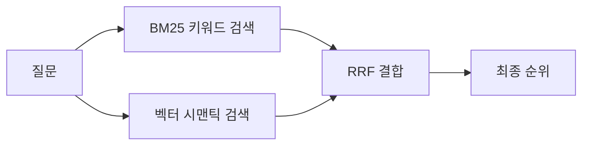

# 이번 스프린트 기술 레퍼런스

## 읽기 가이드

이 문서는 **12개 섹션**으로 구성되어 있습니다. 트랙에 따라 필독 범위가 다릅니다.

| 구분 | 필독 섹션 |
|------|-----------|
| **공통 필독** | 1~4 (`[공통]` 태그) |
| **Track A 추가 필독** | 5~8 (`[Track A]` 태그) |
| **Track B 추가 필독** | 9~12 (`[Track B]` 태그) |

> 관심 있다면 다른 트랙의 섹션도 읽어보세요. 평가 시스템(섹션 1)과 동적 Threshold(섹션 3)는 양 트랙 모두에서 활용됩니다.

## 목차

### 공통
- [1. 평가 시스템의 함정](#공통-1-평가-시스템의-함정)
- [2. 어떤 임베딩 모델을 써야 할까?](#공통-2-어떤-임베딩-모델을-써야-할까)
- [3. 동적 Threshold](#공통-3-동적-threshold)
- [4. 혼합 프로바이더 패턴](#공통-4-혼합-프로바이더-패턴)

### Track A — RAG 정밀도 개선
- [5. PDF 테이블 파싱](#track-a-5-pdf-테이블-파싱)
- [6. PDF 이미지/차트 인식](#track-a-6-pdf-이미지차트-인식)
- [7. Hybrid Search 원리](#track-a-7-hybrid-search-원리) ← Perplexity AI 파이프라인 분석 포함
- [8. 환각 방지 전략](#track-a-8-환각-방지-전략)

### Track B — 멀티모달 검색 품질 개선
- [9. VLM 프레임 분석과 멀티모달 검색](#track-b-9-vlm-프레임-분석과-멀티모달-검색) ← Twelve Labs 파이프라인 분석 포함
- [10. STT 후처리 파이프라인](#track-b-10-stt-후처리-파이프라인)
- [11. 동적 Threshold — Track B 적용 가이드](#track-b-11-동적-threshold--track-b-적용-가이드)
- [12. LLM-as-Judge 개선 전략](#track-b-12-llm-as-judge-개선-전략)

---

## [공통] 1. 평가 시스템의 함정

LLM-as-Judge 방식의 평가는 편리하지만 주의해야 할 **한계**가 있습니다. 이번 스프린트에서 지표를 다룰 때 반드시 알아야 할 4가지 함정입니다.

### 1-1. 올바른 거부 0점 역설

문서(또는 영상)에 없는 내용을 질문했을 때, 시스템이 "해당 정보가 없습니다"라고 **올바르게 거부**하는 것은 정상 동작입니다. 그러나 LLM Judge는 이를 "질문에 답하지 못했다"고 판단하여 **0점**을 부여합니다.

```
질문: "이 보고서에서 CEO의 취미는?"
시스템: "해당 정보는 문서에 포함되어 있지 않습니다."
Judge: Answer Relevance = 0.0  ← 올바른 거부인데 실패로 기록됨
```

이 역설 때문에 시스템이 잘 동작할수록 자동 지표가 낮아지는 모순이 발생합니다.

**대응**: 수동 검증에서 "올바른 거부"를 별도로 판정하고, 자동 지표와 수동 검증의 불일치를 upgrade-report에 기록합니다.

### 1-2. LLM Judge 0.7 천장

LLM Judge의 점수는 0.0~1.0 범위이지만, 실제로는 **0.7 전후에서 천장에 부딪히는** 경향이 있습니다. 0.7→0.8로 올리는 것은 0.3→0.7로 올리는 것보다 훨씬 어렵고, 프롬프트 조정에 과도하게 시간을 소모할 수 있습니다.

**대응**: 0.7 이상이면 자동 지표 최적화보다 **수동 검증 품질 향상**에 집중하세요.

### 1-3. 동의어·추론 실패

LLM Judge는 표현이 다르면 같은 의미도 불일치로 판단할 수 있습니다.

```
기대 답변: "매출이 15% 증가했다"
시스템 답변: "전년 대비 매출이 15퍼센트 성장했다"
Judge: 불일치 판정 → 낮은 점수
```

**대응**: 평가 프롬프트에 **동의어 추론 규칙**을 추가합니다. 예를 들어 "증가/성장/상승은 같은 의미", "15%와 15퍼센트는 같은 수치"라는 규칙을 명시합니다 (Track B 섹션 12에서 구체적으로 다룹니다). 또는 수동 검증에서 의미적 동일성을 직접 판정하세요.

### 1-4. 빈 컨텍스트 허위 만점

검색 결과가 0건일 때 LLM이 자체 지식으로 답변하면, Groundedness(답변이 검색된 근거에 기반하는 정도를 측정하는 지표) 평가에서 **비교할 컨텍스트가 없어** 오히려 높은 점수가 나올 수 있습니다.

**대응**: 검색 결과 0건인 질문들을 별도로 추적하여, 해당 케이스의 지표를 분리하여 분석합니다.

---

## [공통] 2. 어떤 임베딩 모델을 써야 할까?

이번 스프린트에서 쓸 수 있는 임베딩 모델을 비교해봅시다.

| 제공자 | 모델 | 차원 | 한국어 성능 | 비용 |
|--------|------|------|------------|------|
| Ollama (로컬) | `nomic-embed-text` | 768 | 보통 — 한국어 유사도 압축 현상 | 무료 |
| Ollama (로컬) | `bge-m3` | 1024 | 우수 — 다국어 특화 모델 | 무료 |
| OpenAI (클라우드) | `text-embedding-3-small` | 1536 | 우수 | 유료 |

### nomic-embed-text의 한국어 문제

`nomic-embed-text`는 영어 중심 학습 데이터로 훈련되어, 한국어 텍스트 간 유사도가 **좁은 범위로 압축**되는 현상이 있습니다. 쉽게 말하면, 의미가 전혀 다른 한국어 문장들도 비슷한 유사도 점수를 받게 됩니다.

**구체적 예시**: 동일한 질문 "결제 버튼은 어디에 있나요?"로 검색할 때:

```
nomic-embed-text (768d):
  "결제 버튼을 찾기 어려웠어요"  → 유사도 0.72
  "오늘 날씨가 좋았어요"        → 유사도 0.68  ← 무관한 문장인데 차이가 0.04뿐
  "메뉴 디자인을 바꿔야 해요"    → 유사도 0.70

bge-m3 (1024d):
  "결제 버튼을 찾기 어려웠어요"  → 유사도 0.85
  "오늘 날씨가 좋았어요"        → 유사도 0.31  ← 관련 없는 문장은 확실히 낮음
  "메뉴 디자인을 바꿔야 해요"    → 유사도 0.52
```

`nomic-embed-text`에서는 관련 있는 문장(0.72)과 무관한 문장(0.68)의 점수 차이가 너무 작아서, threshold를 어디로 잡아도 정확한 필터링이 어렵습니다. `bge-m3`는 관련성에 따라 점수가 **넓게 분포**하여 검색 정밀도가 크게 향상됩니다.

### bge-m3 권장

`bge-m3`는 100개 이상의 언어를 지원하는 다국어 임베딩 모델로, 한국어에서 `nomic-embed-text` 대비 유사도 분포가 뚜렷하게 개선됩니다. **Track B는 필수로 전환**, Track A는 선택사항입니다.

> **주의**: 임베딩 모델을 변경하면 DB 차원 수도 변경해야 합니다. 768d → 1024d로 전환 시 Supabase 테이블 스키마 수정과 데이터 재임베딩이 필요합니다.

---

## [공통] 3. 동적 Threshold

### 고정 threshold가 왜 문제일까?

벡터 검색에서 `similarity_threshold`를 고정값(예: 0.5)으로 설정하면 두 가지 문제가 발생합니다:

1. **너무 높으면**: 관련 있는 결과도 걸러져서 검색 결과 0건 → LLM이 환각으로 답변
2. **너무 낮으면**: 무관한 결과가 포함되어 답변 품질 저하

질문마다 최적 threshold가 다르기 때문에, 하나의 고정값으로는 모든 질문에 대응할 수 없습니다.

### 해결 접근법

**방법 1: 최소 결과 보장**
```python
results = vector_search(query, threshold=0.5)
if len(results) == 0:
    results = vector_search(query, threshold=0.3)  # 낮춰서 재시도
```

**방법 2: Top-k + 최소 유사도 결합**
```python
results = vector_search(query, top_k=5)
results = [r for r in results if r.get("similarity", 0) > 0.2]  # 최소 기준만 필터
```

**방법 3: 분포 기반 컷오프**
```python
import statistics

scores = [r.similarity for r in vector_search(query, top_k=10)]
mean, std = statistics.mean(scores), statistics.stdev(scores)
threshold = mean - std  # 이하는 제거
```

### 어떤 방법을 먼저 시도할까?

| 방법 | 난이도 | 권장 시작 | 적합한 상황 |
|------|--------|----------|------------|
| 방법 1 (폴백) | 쉬움 | primary=0.5, fallback=0.3 | 가장 먼저 시도. 구현이 간단하고 효과가 즉각적 |
| 방법 2 (Top-k + 최소) | 쉬움 | top_k=5, min=0.2 | 항상 일정 개수의 결과가 필요한 경우 |
| 방법 3 (분포 기반) | 보통 | — | 결과 수가 충분히 많고, 통계적 접근이 필요한 경우 |

> **권장**: 방법 1(2단계 폴백)부터 시작하세요. 코드 변경이 가장 적고 0건 문제를 즉시 해결합니다. 이후 필요에 따라 방법 2, 3으로 발전시키세요.

---

## [공통] 4. 혼합 프로바이더 패턴

### 문제: 단일 PROVIDER 설정의 한계

기존 스프린트의 `.env` 설정:
```ini
# 스프린트 2 (RAG): PROVIDER=ollama
# 스프린트 3 (멀티모달): PROVIDER=local
# → 프로젝트마다 키 이름이 다를 수 있으니, 본인의 .env를 확인하세요
PROVIDER=ollama   # 또는 local — 임베딩과 채팅 모두 하나의 값으로 제어
```

이 구조에서는 임베딩만 로컬, 채팅만 유료 API로 바꾸는 것이 불가능합니다. `PROVIDER=openai`로 변경하면 임베딩도 함께 OpenAI로 전환되어 비용이 증가하고, DB 차원 변경이 필요합니다.

### 해결: EMBED_PROVIDER / CHAT_PROVIDER 분리

```ini
EMBED_PROVIDER=ollama
EMBED_MODEL=bge-m3

CHAT_PROVIDER=openai
CHAT_MODEL=gpt-4o-mini
```

임베딩과 채팅을 **독립적으로 설정**할 수 있습니다. 이 패턴을 적용하면:
- 로컬 임베딩(무료) + 유료 채팅(고품질) 조합이 가능
- 임베딩 모델만 교체해도 채팅 모델에 영향 없음
- 실험 시 변수를 하나만 격리하여 테스트 가능

> **Track B**: Weekend-1 전반부에서 이 리팩토링을 수행합니다 (필수).
> **Track A**: 필요 시 참고하여 적용하세요.

---

## [Track A] 5. PDF 테이블 파싱

### PDF에서 표 데이터가 왜 깨질까?

보고서, 논문, 재무자료 등 실무 PDF에는 **핵심 데이터가 테이블 형태**로 정리되어 있습니다. "Q2 매출이 얼마인가?"라는 질문에 답하려면 테이블의 행/열 구조를 이해해야 합니다. 그런데 기본 텍스트 추출 라이브러리는 이 구조를 전혀 인식하지 못합니다.

> **실제 서비스에서는?** ChatGPT에 PDF를 업로드하고 "이 표에서 Q2 매출은?"이라고 물어보면 정확히 답합니다. Google NotebookLM도 PDF의 테이블 데이터를 구조적으로 이해하여 답변합니다. 여러분이 이번에 구현하는 것이 바로 이 기능의 핵심 — **PDF 테이블을 LLM이 이해할 수 있는 형태로 변환하는 파이프라인**입니다.

### 문제: 테이블이 텍스트로 깨짐

PDF에서 텍스트를 추출할 때 `PyPDF2`, `pdfminer` 등 기본 라이브러리는 테이블의 행/열 구조를 인식하지 못합니다. 결과적으로 테이블 데이터가 **의미 없는 텍스트 조각**으로 변환됩니다.

```
원본 테이블:
| 분기 | 매출 | 성장률 |
|------|------|--------|
| Q1   | 100억 | 15%   |
| Q2   | 120억 | 20%   |

추출 결과 (깨진 텍스트):
"분기 매출 성장률 Q1 100억 15% Q2 120억 20%"
→ 어떤 수치가 어떤 분기에 해당하는지 구분 불가
```

### 라이브러리 비교

| 라이브러리 | 접근 방식 | 장점 | 단점 |
|-----------|-----------|------|------|
| `pdfplumber` | 텍스트 좌표 기반 테이블 감지 | 설치 쉬움, 대부분의 표에 대응 | 복잡한 병합 셀에 약함 |
| `camelot` | 격자선 기반 + 스트림 기반 | 격자 있는 표에 매우 정확 | `ghostscript` 시스템 의존성 |
| `unstructured` | 복합 파싱 (테이블+텍스트+이미지) | 올인원 | 무겁고, 학습 곡선 있음 |

### 권장 접근

1. `pdfplumber`로 시작 — 설치가 간단하고 macOS에서 추가 의존성 없음
2. 테이블을 감지하면 **마크다운 형식**으로 변환하여 청크에 저장
3. 테이블이 없는 페이지는 기존 텍스트 추출 로직 유지

```python
# 의사 코드 — 전체 흐름을 보여주기 위한 구조입니다.
import pdfplumber

with pdfplumber.open("report.pdf") as pdf:
    for page in pdf.pages:
        tables = page.extract_tables()
        if tables:
            for table in tables:
                # table은 2차원 리스트: [["분기","매출","성장률"], ["Q1","100억","15%"], ...]
                # 이를 마크다운 표 형식 문자열로 변환하여 청크에 저장
                md = convert_table_to_markdown(table)
                store_as_chunk(md, page_number=page.page_number)
        else:
            text = page.extract_text()
            # 기존 텍스트 청킹 로직
```

---

## [Track A] 6. PDF 이미지/차트 인식

> **실제 서비스에서는?** ChatGPT나 Claude에 차트가 포함된 PDF를 업로드하면, "이 그래프의 추세는?"이라고 물었을 때 차트 이미지를 분석하여 답변합니다. Google Gemini도 문서 내 그래프를 해석하여 수치와 트렌드를 설명합니다. 이 기능의 핵심은 **PDF에서 이미지를 추출 → Vision 모델로 분석 → 텍스트로 변환하여 검색 가능하게 만드는 파이프라인**입니다.

### 문제: 이미지가 완전히 무시됨

PDF에 포함된 차트, 그래프, 다이어그램은 텍스트 추출 시 **존재 자체가 누락**됩니다. "보고서의 차트에서 가장 높은 수치는?"이라는 질문에 시스템은 아무것도 찾지 못합니다.

### 차트 속 숫자, 텍스트 추출만으로 찾을 수 있을까?

PDF 보고서의 핵심 데이터는 종종 **차트와 그래프에만** 존재합니다. 텍스트로 "매출이 증가했습니다"라고 쓰여 있지만, **정확한 수치와 추세**는 차트에서만 확인할 수 있습니다. 텍스트 추출만으로는 이 정보에 절대 접근할 수 없습니다.

### 해결 접근 (3단계)

PDF에서 이미지를 추출하고, Vision 모델로 분석하여, 검색 가능한 텍스트로 저장하는 파이프라인입니다.

**1단계: PDF 페이지에서 이미지 추출**

`PyMuPDF(fitz)` 라이브러리가 이미지 추출에 가장 적합합니다:

```python
import fitz  # PyMuPDF — pip install PyMuPDF

def extract_images_from_pdf(pdf_path: str, output_dir: str = "extracted_images"):
    """PDF의 각 페이지에서 이미지를 추출하여 파일로 저장"""
    import os
    os.makedirs(output_dir, exist_ok=True)
    doc = fitz.open(pdf_path)
    images = []

    for page_num, page in enumerate(doc):
        for img_index, img in enumerate(page.get_images(full=True)):
            xref = img[0]
            pix = fitz.Pixmap(doc, xref)
            if pix.n - pix.alpha > 3:  # CMYK 색상 공간(4채널)이면 RGB로 변환
                pix = fitz.Pixmap(fitz.csRGB, pix)
            img_path = f"{output_dir}/page{page_num + 1}_img{img_index + 1}.png"
            pix.save(img_path)
            images.append({"page": page_num + 1, "path": img_path})
            pix = None

    doc.close()
    return images  # [{"page": 1, "path": "..."}, ...]
```

**2단계: Vision 모델로 이미지 설명 생성**

추출된 이미지를 Vision 모델에 전달하여 텍스트 설명을 얻습니다.

| 모델 | 비용 | 품질 | 권장 용도 |
|------|------|------|-----------|
| `gemma3` (Ollama 로컬) | 무료 | 보통 | 실험·개발 단계 |
| `gpt-4o` (OpenAI) | 유료 | 우수 | 최종 비교 시에만 |

```python
import ollama

def describe_image(image_path: str) -> str:
    """Vision 모델로 이미지의 내용을 텍스트로 설명"""
    response = ollama.chat(
        model="gemma3",
        messages=[{
            "role": "user",
            "content": "이 이미지의 차트/그래프를 분석하고 주요 수치와 추세를 설명하세요.",
            "images": [image_path]
        }]
    )
    return response.message.content
```

**3단계: 설명 텍스트를 페이지 번호와 함께 검색 가능한 청크로 저장**

```python
# 1~2단계를 연결하는 전체 흐름
images = extract_images_from_pdf("report.pdf")
for img in images:
    description = describe_image(img["path"])
    # 예: "p.3 차트: Q1 100억, Q2 120억, Q3 150억. 매출이 분기별로 증가하는 추세."
    store_as_chunk(f"[페이지 {img['page']} 이미지] {description}",
                   page_number=img["page"])
```

> **모듈 1+2 통합 안내**: 모듈 1(테이블)과 모듈 2(이미지)는 같은 PDF 처리 파이프라인을 수정합니다. 모듈 1을 완주 스토리로 선택하면 모듈 2를 추가 모듈로 확장하기 수월합니다. 같은 코드 경로에서 테이블 감지 → 이미지 감지를 순서대로 추가하면 됩니다.

---

## [Track A] 7. Hybrid Search 원리

### 벡터 검색이 "GDP"를 못 찾는 이유는?

벡터 시맨틱 검색은 **"의미가 비슷한 문장"**을 찾는 데 뛰어나지만, **"정확히 이 단어가 들어간 문장"**을 찾는 데는 약합니다. 반대로 키워드 검색은 정확한 단어 매칭에 강하지만 의미적 유사성은 잡지 못합니다. 두 방식을 결합하면 **서로의 약점을 보완**할 수 있습니다.

> **실제 서비스에서는?** Perplexity AI는 사용자 질문에 답할 때 웹에서 키워드 매칭과 의미 검색을 결합하여 관련 문서를 찾습니다. ChatGPT의 파일 검색(Assistants API)도 업로드된 문서에 대해 벡터 검색과 키워드 검색을 자동으로 결합합니다 ([OpenAI 공식 문서](https://platform.openai.com/docs/assistants/tools/file-search) — "use both vector and keyword search"). 벡터 검색만으로 서비스하는 RAG 시스템은 거의 없습니다 — 실무에서 배포되는 AI 검색 파이프라인은 대부분 Hybrid Search입니다.

### 참고: Perplexity AI의 검색 파이프라인

Perplexity AI는 여러분이 만드는 것과 같은 **RAG 아키텍처**로 동작합니다. 월 7.8억 건의 쿼리를 처리하며, 모든 응답에 평균 21.87개의 출처를 인용합니다. 그 내부를 들여다보면 5단계 파이프라인으로 구성되어 있습니다 ([상세 분석](https://www.promptalpha.ai/blog/how-perplexity-decides-what-to-cite)).

| 단계 | Perplexity가 하는 일 | 여러분의 모듈에서는? |
|------|---------------------|-------------------|
| 1. 쿼리 분석 | 질문의 의도를 파악하고, 복잡한 질문은 여러 하위 질문으로 분해 | 선택 모듈: HyDE, Query Rewriting |
| 2. 검색 | 2,000억+ URL 인덱스에서 키워드 + 의미 검색을 결합하여 후보 문서 수집 | **모듈 3: Hybrid Search** |
| 3. 리랭킹 | L3 리랭커가 관련성·신뢰도·최신성 기준으로 필터링 — 기준 미달 소스는 제거 | 모듈 3-4: threshold 조정, 선택 모듈: Cross-encoder |
| 4. LLM 합성 | 필터링된 소스만을 기반으로 답변 생성 — 학습 지식이 아닌 **검색 컨텍스트에서만** 답변 | **모듈 4: 환각 방지** |
| 5. 인라인 인용 | 모든 주장에 출처 번호를 달아 반환 (응답당 평균 21.87개) | 발전 경로: Groundedness Check |

ChatGPT는 질문의 약 46%에서만 웹 검색을 실행하지만, Perplexity는 **모든 질문에 대해 실시간 검색을 실행**합니다. 학습 데이터에만 의존하는 모드가 없다는 것은, 검색 품질이 곧 서비스 품질이라는 뜻입니다 — 여러분이 이번 스프린트에서 Hybrid Search를 구현하는 이유이기도 합니다.

```
질문: "GDP 성장률이 언급된 부분은?"
벡터 검색: "경제 성장"과 관련된 청크를 찾지만 "GDP"라는 정확한 약어를 포함한 청크를 놓침
키워드 검색: "GDP"라는 글자가 정확히 포함된 청크를 바로 찾음
→ 둘을 합치면 두 종류의 매칭 모두 커버 가능
```

### BM25 알고리즘: 직관적 이해

BM25는 검색 엔진의 고전적인 **키워드 기반 검색** 알고리즘입니다. 핵심 아이디어 두 가지:

**TF (Term Frequency, 단어 빈도)**: 한 문서 안에서 검색어가 자주 등장할수록 관련성이 높다.
- "GDP"가 3번 나오는 청크 > 1번 나오는 청크

**IDF (Inverse Document Frequency, 역문서 빈도)**: 전체 문서에서 드물게 등장하는 단어일수록 **구별력이 높다**.
- "GDP"는 소수 청크에만 등장 → IDF 높음 → 검색 가치 높음
- "있습니다"는 거의 모든 청크에 등장 → IDF 낮음 → 검색 가치 낮음

> 직관적으로, BM25는 "**이 단어가 이 문서에 많이 나오면서, 다른 문서에는 별로 없다면 이 문서가 관련성이 높다**"고 판단합니다.

### Hybrid Search 흐름

Hybrid Search는 BM25와 벡터 검색을 **동시에 실행**하고, 결과를 **RRF(Reciprocal Rank Fusion)**로 결합합니다.



### RRF(Reciprocal Rank Fusion): 수치 예시

RRF는 "각 검색 방법에서 높은 순위를 받은 문서일수록 최종 점수가 높다"는 단순한 원리입니다.

**공식**: 각 문서의 최종 점수 = Σ 1/(k + rank), 여기서 k는 상수(보통 60)

**구체적 예시** — 질문: "GDP 성장률은 얼마인가?"

```
BM25 결과:          벡터 검색 결과:
  1위: 청크 A         1위: 청크 C
  2위: 청크 B         2위: 청크 A
  3위: 청크 D         3위: 청크 E

RRF 점수 계산 (k=60):
  청크 A: 1/(60+1) + 1/(60+2) = 0.0164 + 0.0161 = 0.0325  ← 최종 1위
  청크 C: 0        + 1/(60+1) = 0.0164                      ← 최종 2위
  청크 B: 1/(60+2) + 0        = 0.0161                      ← 최종 3위
```

청크 A가 **두 검색 방법 모두에서** 상위에 있었기 때문에 최종 1위가 됩니다. 이처럼 RRF는 **양쪽에서 고르게 인정받은 문서**를 우선합니다.

### 한국어 BM25: 왜 형태소 분석이 필요한가?

BM25는 **단어 단위로 분리된 입력**을 요구합니다. 영어는 공백(space)으로 단어가 자연스럽게 분리되지만, 한국어는 사정이 다릅니다.

**형태소(形態素)란?** 의미를 가지는 가장 작은 언어 단위입니다. "경제성장률은"이라는 한 단어는 "경제" + "성장률" + "은"이라는 3개의 형태소로 구성됩니다. 여기서 "은"은 조사(문법적 기능만 하는 요소)입니다.

```
"경제성장률은" → 공백 분리: ["경제성장률은"] → "경제성장률"로 검색해도 매칭 실패
                                              ("경제성장률은" ≠ "경제성장률")

"경제성장률은" → 형태소 분석: ["경제", "성장률", "은"] → "경제성장률" 검색 시
                                                      "경제"와 "성장률"이 매칭됨!
```

한국어에서 공백 분리만 사용하면 **조사 하나 때문에** 검색이 실패합니다. 형태소 분석기를 사용하면 조사를 분리하여 정확한 키워드 매칭이 가능해집니다.

### kiwipiepy 사용법

**`kiwipiepy`**는 한국어 형태소 분석기입니다. macOS에서 추가 시스템 의존성 없이 `pip install`만으로 설치할 수 있어 권장합니다.

```bash
pip install kiwipiepy
```

```python
from kiwipiepy import Kiwi

kiwi = Kiwi()

def tokenize_korean(text: str) -> list[str]:
    """한국어 텍스트를 형태소 단위로 토큰화"""
    return [token.form for token in kiwi.tokenize(text)]

# 사용 예시
tokenize_korean("경제성장률은 전년 대비 증가했다")
# → ["경제", "성장률", "은", "전년", "대비", "증가", "했", "다"]
#    ├─ 의미어 ─────────┤ 조사  ├─ 의미어 ──────────────────┤
```

### BM25 + kiwipiepy 통합

```python
from rank_bm25 import BM25Okapi

corpus = [tokenize_korean(chunk.content) for chunk in all_chunks]
bm25 = BM25Okapi(corpus)

query_tokens = tokenize_korean("GDP 성장률")
bm25_scores = bm25.get_scores(query_tokens)
```

> **설치 요약**: `pip install kiwipiepy rank-bm25` — 두 패키지만 추가하면 한국어 Hybrid Search를 구현할 수 있습니다.

---

## [Track A] 8. 환각 방지 전략

### 문서에 없는 내용을 시스템이 지어낸다면?

RAG 시스템에서 사용자가 문서에 없는 내용을 질문하면, LLM이 자체 학습 지식을 동원하여 **"모르겠다"고 말하는 대신 그럴듯한 거짓 정보를 만들어냅니다**. 이것이 환각(hallucination)이며, 실 서비스에서 가장 치명적인 문제입니다. 특히 의료, 법률, 금융 등의 도메인에서는 환각이 심각한 피해를 초래할 수 있습니다.

> **실제 서비스에서는?** Perplexity AI는 모든 답변에 출처 번호를 달고 (응답당 [평균 21.87개 인라인 인용](https://www.promptalpha.ai/blog/how-perplexity-decides-what-to-cite)), 근거가 부족하면 해당 사실을 명시합니다. ChatGPT도 "I don't have information about that"이라고 거부하도록 개선되었고, Google AI Overview는 반드시 검색 결과 링크와 함께 답변을 제공합니다. "모르면 모른다고 말하는 AI"는 현재 AI 서비스의 핵심 신뢰 요소입니다.

### 접근법 1: 검색 신뢰도 기반 거부

검색 결과의 유사도가 낮으면 "문서에 해당 정보가 없습니다"라고 거부합니다.

```python
results = vector_search(query, top_k=5)
max_similarity = max(r.similarity for r in results) if results else 0

if max_similarity < REFUSAL_THRESHOLD:  # 시작값: 0.3~0.4 권장
    return "질문과 관련된 내용이 문서에 포함되어 있지 않습니다."
```

> **시작값 가이드**: `REFUSAL_THRESHOLD`를 너무 높게 잡으면 정상 질문도 거부합니다. **0.3~0.4** 사이에서 시작하여 테스트 결과를 보며 조정하세요.

### 접근법 2: 프롬프트 기반 거부

시스템 프롬프트에 거부 규칙을 강화합니다.

```
당신은 문서 기반 답변 시스템입니다.
규칙:
1. 반드시 제공된 컨텍스트 내에서만 답변하세요.
2. 컨텍스트에 답변할 근거가 없으면 "문서에 해당 정보가 없습니다"라고 명시하세요.
3. 추측이나 일반 지식으로 답변하지 마세요.
```

### 트레이드오프: 과도한 거부 방지

거부 threshold를 너무 높이면 정상 질문까지 거부하는 문제가 발생합니다.

| 질문 유형 | 이상적 동작 |
|-----------|------------|
| A. 문서에 답이 있는 질문 | 정확히 답변 |
| B. 문서에 답이 부분적인 질문 | 있는 내용만 답변 + "추가 정보는 없습니다" |
| C. 문서에 전혀 없는 질문 | "해당 정보가 없습니다"로 거부 |

핵심은 **A 유형의 정확도를 유지하면서 C 유형을 거부**하는 균형점을 찾는 것입니다.

### 발전 경로: 사전 거부를 넘어서

> **접근법 1~2만 적용해도 완주 스토리로 충분합니다.** 아래 3단계는 시간이 남거나 더 깊이 탐구하고 싶을 때 도전하세요.

접근법 1(threshold 거부)과 2(프롬프트 거부)는 모두 **답변을 생성하기 전에** 거부를 결정합니다. 하지만 이것만으로는 잡히지 않는 환각이 있습니다.

```
질문: "이 보고서에서 삼성전자의 매출은?"
검색 결과: "국내 반도체 산업의 매출은 전년 대비 15% 증가..." (유사도 0.52)
→ threshold(0.4)를 넘었으므로 거부하지 않음
→ LLM이 "삼성전자의 매출은 15% 증가했습니다"라고 답변
→ 실제로는 "반도체 산업" 전체 이야기인데 "삼성전자"로 환각
```

검색 결과가 **있긴 하지만 질문과 미묘하게 다른 경우**, 사전 거부로는 막을 수 없습니다. LLM이 관련 있어 보이는 청크를 억지로 연결하여 환각을 만들어내기 때문입니다.

#### 3단계: 답변 생성 후 근거 검증 (Groundedness Check)

답변을 먼저 생성한 뒤, **별도의 검증 단계**에서 "이 답변이 실제로 컨텍스트에 근거하는가?"를 확인합니다. 실제 프로덕션 RAG 시스템에서 널리 사용되는 패턴입니다.

```python
def verify_groundedness(answer: str, context: str) -> dict:
    """답변의 각 주장이 컨텍스트에 근거하는지 검증"""
    prompt = f"""아래 답변의 각 문장이 컨텍스트에 근거하는지 판단하세요.

컨텍스트:
{context}

답변:
{answer}

각 문장에 대해:
- "근거 있음": 컨텍스트에서 직접 확인 가능
- "근거 불충분": 컨텍스트와 관련은 있으나 정확히 일치하지 않음
- "근거 없음": 컨텍스트에 해당 정보 없음

JSON 형식으로 반환하세요."""

    # LLM 호출로 검증 수행
    result = call_llm(prompt)
    return result
```

**동작 흐름:**

```
[기존]
질문 → 검색 → (threshold 통과?) → 답변 생성 → 사용자에게 반환

[3단계 적용]
질문 → 검색 → (threshold 통과?) → 답변 생성 → 근거 검증 → 근거 있는 부분만 반환
                                                         └ "근거 없음" 문장은 제거하거나
                                                           "이 부분은 문서에서 확인되지 않았습니다" 경고 첨부
```

**구체적 예시 — Before/After:**

```
Before (3단계 없음):
  질문: "삼성전자의 매출은?"
  답변: "삼성전자의 매출은 15% 증가했습니다." ← 환각 (실제로는 산업 전체 수치)

After (3단계 적용):
  질문: "삼성전자의 매출은?"
  답변 생성: "삼성전자의 매출은 15% 증가했습니다."
  근거 검증: "삼성전자" → 컨텍스트에 없음, "15% 증가" → "반도체 산업"에 대한 수치
  최종 반환: "문서에는 반도체 산업 전체의 매출이 15% 증가했다는 내용이 있으나,
             삼성전자 개별 매출에 대한 정보는 포함되어 있지 않습니다."
```

**트레이드오프:**
- LLM 호출이 1회 → 2회로 증가 (비용·지연 2배)
- 하지만 환각 답변이 사용자에게 전달되는 것을 사후에 차단할 수 있음
- gpt-4o-mini로 검증하면 추가 비용은 질문당 약 $0.001~0.003

> **이 패턴이 중요한 이유**: 실 서비스에서 환각은 단순한 "오답"이 아니라 **신뢰 상실**로 이어집니다. 특히 금융·법률·의료 도메인에서는 한 번의 환각이 서비스 전체의 신뢰를 무너뜨릴 수 있습니다. "생성 후 검증"은 이런 리스크를 관리하는 실무 패턴입니다.

---

## [Track B] 9. VLM 프레임 분석과 멀티모달 검색

### 발표자가 말하지 않고 화면에만 보여준 정보, 어떻게 검색할까?

스프린트 3 (멀티모달)에서 구현한 영상 QA 시스템은 **STT 전사 텍스트**만으로 검색합니다. 하지만 실제 영상에서는 발표자가 코드, 슬라이드, 차트를 **화면에 보여주기만 하고 말로 설명하지 않는** 경우가 많습니다. 이런 정보는 현재 시스템에서 완전히 누락됩니다.

> **실제 서비스에서는?** Google Lens는 카메라로 촬영한 화면의 텍스트와 물체를 인식하여 검색·번역·복사를 지원합니다. ChatGPT와 Claude에 영상 스크린샷을 보내면 화면 속 코드, 차트, 텍스트를 읽고 질문에 답합니다. Google Meet의 회의 요약도 화면 공유 내용을 포함하여 노트를 생성합니다. 이 모든 서비스의 공통점은 **시각 정보를 텍스트로 변환하여 검색·분석 가능하게 만드는 것**입니다.

```
발표자: (슬라이드에 "매출 3,245억원" 표시, 말은 "이 수치를 보시면...")
전사: "이 수치를 보시면"
→ "매출 수치가 얼마인가?" 질문에 답변 불가
```

VLM(Vision-Language Model)으로 영상 프레임을 분석하면 화면 속 텍스트 정보를 추출하여 검색 가능하게 만들 수 있습니다.

### 참고: Twelve Labs의 멀티모달 검색 파이프라인

여러분이 이번 스프린트에서 만드는 멀티모달 영상 검색 시스템은, 실제로 **B2B AI 제품**으로 서비스되고 있습니다. [Twelve Labs](https://twelvelabs.io/)는 영상을 업로드하면 시각·음성·화면 텍스트를 동시에 분석하여 자연어로 검색할 수 있게 해주는 비디오 이해 AI 플랫폼입니다 ([아키텍처 문서](https://docs.twelvelabs.io/docs/resources/platform-overview)).

| Twelve Labs 파이프라인 | 하는 일 | 여러분의 모듈에서는? |
|----------------------|--------|-------------------|
| 1. 영상 인덱싱 | 영상을 업로드하면 시각(프레임)과 오디오(음성)를 **동시에** 분석하여 멀티모달 임베딩 생성 | Day 0: bge-m3 임베딩 전환 |
| 2. 시각 분석 (Marengo) | 프레임에서 사람, 물체, 화면 텍스트(OCR), 장면 전환, 로고를 인식 | **모듈 1: VLM 프레임 분석** |
| 3. 오디오 분석 | 음성을 전사하고, 음악·효과음·대화를 분류 | **모듈 2: STT 후처리** |
| 4. 자연어 검색 | "가격을 설명하는 장면"처럼 자연어 쿼리로 특정 구간을 검색 | **모듈 3: 동적 Threshold** |
| 5. 텍스트 생성 (Pegasus) | 영상 요약, 캡션, 맞춤형 리포트를 생성 | **모듈 4: LLM-as-Judge** (품질 평가) |

기존의 영상 AI 솔루션은 이미지 API와 음성 API를 **따로따로** 호출하고 결과를 수동으로 합쳐야 했습니다. Twelve Labs의 핵심 차별점은 시각+음성을 **하나의 모델이 동시에** 이해하는 것입니다. 여러분이 이번 스프린트에서 하는 작업 — VLM으로 프레임을 분석하고 STT 전사 텍스트와 결합하여 검색하는 것 — 이 바로 이 접근법의 핵심입니다.

> Twelve Labs는 개발자용 API 제품이라 직접 사용해본 적은 없을 수 있지만, 여러분이 만드는 파이프라인이 실제 AI 스타트업의 **핵심 제품**과 같은 구조라는 점에서 의미가 있습니다. Google Gemini에 영상을 업로드하고 질문하는 기능도 같은 원리입니다.

### 프레임 추출 코드

영상에서 일정 간격으로 프레임을 이미지로 저장하는 코드입니다. `opencv-python`은 영상을 프레임 단위로 읽고 이미지로 저장하는 데 사용되는 라이브러리입니다 (스프린트 3 (멀티모달)에서 사용한 `ffmpeg`은 미디어 변환 도구로, 역할이 다릅니다).

```bash
pip install opencv-python
```

```python
import cv2
import os

def extract_frames(video_path: str, interval_seconds: float = 10.0,
                   output_dir: str = "frames") -> list[dict]:
    """영상에서 일정 간격으로 프레임을 추출하여 이미지로 저장"""
    os.makedirs(output_dir, exist_ok=True)
    cap = cv2.VideoCapture(video_path)
    fps = cap.get(cv2.CAP_PROP_FPS)
    frame_interval = int(fps * interval_seconds)
    frames = []
    frame_count = 0

    while cap.isOpened():
        ret, frame = cap.read()
        if not ret:
            break
        if frame_count % frame_interval == 0:
            timestamp = frame_count / fps
            img_path = os.path.join(output_dir, f"frame_{frame_count:06d}.jpg")
            cv2.imwrite(img_path, frame)
            frames.append({"timestamp": timestamp, "path": img_path})
        frame_count += 1

    cap.release()
    return frames  # [{"timestamp": 0.0, "path": "frames/frame_000000.jpg"}, ...]
```

### 프레임 샘플링 전략

영상의 모든 프레임을 분석하는 것은 비현실적입니다(30fps 영상 2분 = 3,600 프레임). **일정 간격으로 키 프레임을 추출**합니다.

| 샘플링 간격 | 2분 영상 기준 프레임 수 | 처리 시간 (gemma3) |
|------------|----------------------|-------------------|
| 5초 | 24개 | ~8분 |
| 10초 | 12개 | ~4분 |
| 15초 | 8개 | ~2.5분 |

> **권장**: 10~15초 간격으로 시작하고, 파이프라인이 안정된 후 필요 시 줄입니다.

### 단계적 접근 (권장)

1. 먼저 **2분 이하의 짧은 영상**으로 파이프라인을 검증 (프레임 수가 적어 빠르게 반복 가능)
2. 초기 샘플링 간격은 **10~15초**로 넉넉하게 시작
3. 파이프라인이 동작하면 전체 영상에 적용
4. `gemma3`로 먼저 테스트하고, 품질이 부족한 경우에만 `gpt-4o`로 비교

### VLM 프롬프트 설계

프롬프트에 따라 VLM 출력 품질이 크게 달라집니다.

```
나쁜 프롬프트: "이 이미지를 설명하세요."
→ "사람이 컴퓨터 앞에 앉아 있습니다." (너무 일반적)

좋은 프롬프트:
"이 영상 프레임의 화면에 표시된 텍스트, 코드, 슬라이드, 차트, 숫자를
빠짐없이 추출하세요. 화면에 보이는 내용만 기술하고 추측하지 마세요."
→ "슬라이드 제목: '2024 매출 현황'. 표에 Q1 100억, Q2 120억이 표시됨."
```

### 시각 정보의 텍스트 세그먼트 변환

VLM이 추출한 텍스트를 **타임스탬프와 함께** 기존 세그먼트에 합쳐 저장합니다.

```
[전사] 이 수치를 보시면 작년 대비 크게 증가한 것을 알 수 있습니다.
[화면 02:15] 슬라이드 "2024 매출 현황": Q1 100억, Q2 120억, Q3 150억
```

이 조합된 텍스트가 임베딩되어 저장되면, "매출 수치"로 검색했을 때 해당 세그먼트가 검색됩니다.

### 발전 경로: 고정 간격 샘플링을 넘어서

> **1단계(고정 간격 + VLM)만 완성해도 완주 스토리로 충분합니다.** 아래 2~3단계는 시간이 남거나 더 깊이 탐구하고 싶을 때 도전하세요.

고정 간격 샘플링은 가장 간단하지만, 실 서비스 관점에서 **두 가지 명확한 비효율**이 있습니다.

```
문제 1: 같은 슬라이드가 30초간 유지되는 경우 (10초 간격 기준)
  프레임 1 (0:10) → VLM: "슬라이드에 매출 현황 표가 보입니다" → $
  프레임 2 (0:20) → VLM: "슬라이드에 매출 현황 표가 보입니다" → $ (동일한 결과에 비용 낭비)
  프레임 3 (0:30) → VLM: "슬라이드에 매출 현황 표가 보입니다" → $ (또 동일)

문제 2: VLM의 텍스트 추출 정확도
  화면에 보이는 코드: "def calculate_average(scores):"
  VLM 출력: "파이썬 함수가 정의되어 있습니다" ← 함수명이 정확히 나오지 않음
  사용자 검색: "calculate_average 함수" → 매칭 실패
```

#### 2단계: 장면 변화 감지 (Scene Change Detection)

고정 간격 대신 **화면이 실제로 바뀔 때만** 프레임을 캡처합니다. 연속된 두 프레임의 픽셀 차이를 계산하여, 차이가 일정 기준을 넘을 때만 "새로운 장면"으로 판단합니다.

```python
import cv2
import numpy as np

def extract_frames_on_change(video_path: str, threshold: float = 30.0,
                              min_interval: float = 3.0) -> list[dict]:
    """화면이 변할 때만 프레임을 추출 (불필요한 중복 제거)"""
    cap = cv2.VideoCapture(video_path)
    fps = cap.get(cv2.CAP_PROP_FPS)
    frames = []
    prev_frame = None
    frame_count = 0
    last_capture_time = -min_interval

    while cap.isOpened():
        ret, frame = cap.read()
        if not ret:
            break

        timestamp = frame_count / fps
        gray = cv2.cvtColor(frame, cv2.COLOR_BGR2GRAY)

        if prev_frame is not None:
            # 두 프레임 간 픽셀 차이의 평균을 계산
            diff = cv2.absdiff(prev_frame, gray)
            mean_diff = np.mean(diff)

            # 차이가 threshold를 넘고, 최소 간격이 지났을 때만 캡처
            if mean_diff > threshold and (timestamp - last_capture_time) >= min_interval:
                img_path = f"frames/frame_{frame_count:06d}.jpg"
                cv2.imwrite(img_path, frame)
                frames.append({"timestamp": timestamp, "path": img_path})
                last_capture_time = timestamp
        else:
            # 첫 프레임은 항상 캡처
            img_path = f"frames/frame_{frame_count:06d}.jpg"
            cv2.imwrite(img_path, frame)
            frames.append({"timestamp": timestamp, "path": img_path})
            last_capture_time = timestamp

        prev_frame = gray
        frame_count += 1

    cap.release()
    return frames
```

**핵심 아이디어:**
- `cv2.absdiff()`로 이전 프레임과 현재 프레임의 **픽셀 차이를 계산**
- `np.mean(diff)`가 threshold(기본 30.0)를 넘으면 "화면이 바뀌었다"고 판단
- `min_interval`(기본 3초)로 너무 빈번한 캡처를 방지

**효과:**
- 같은 슬라이드가 유지되는 동안 VLM 호출 0회 (비용 절감)
- 슬라이드가 전환되는 순간을 정확히 포착
- 2분 영상 기준, 고정 간격(10초) 12프레임 → 장면 변화 감지 시 보통 5~8프레임으로 감소

#### 3단계: OCR + VLM 결합

VLM은 화면의 전체적인 내용(차트 추세, 레이아웃)을 설명하는 데 뛰어나지만, **정확한 텍스트 추출**에는 한계가 있습니다. 반면 OCR(Optical Character Recognition)은 화면의 **글자를 정확히** 읽어냅니다.

```
화면에 보이는 코드:
  def calculate_average(scores):
      total = sum(scores)
      return total / len(scores)

VLM 출력: "파이썬 함수가 정의되어 있고, 리스트의 합계를 구하는 로직입니다"
→ 대략적 설명은 맞지만 함수명, 변수명이 정확하지 않음

OCR 출력: "def calculate_average(scores):\n    total = sum(scores)\n    return total / len(scores)"
→ 코드를 글자 그대로 추출
```

두 결과를 결합하면 **정확한 텍스트 + 맥락적 설명** 모두를 검색할 수 있습니다:

```
[화면 01:20 OCR] def calculate_average(scores): total = sum(scores) return total / len(scores)
[화면 01:20 VLM] 파이썬 함수가 정의되어 있으며, 점수 리스트의 평균을 계산하는 로직
```

이제 "calculate_average"로 검색해도, "평균 계산 함수"로 검색해도 모두 매칭됩니다.

**OCR 라이브러리:**

```bash
pip install easyocr
```

```python
import easyocr

reader = easyocr.Reader(["ko", "en"])

def extract_text_from_frame(image_path: str) -> str:
    """프레임 이미지에서 화면 텍스트를 OCR로 추출"""
    results = reader.readtext(image_path)
    return " ".join([text for _, text, conf in results if conf > 0.3])
```

**트레이드오프:**
- EasyOCR은 첫 실행 시 모델 다운로드 필요 (~200MB)
- 프레임당 OCR 처리 시간 1~3초 추가
- 하지만 VLM만으로는 불가능한 **정확한 코드·숫자 추출**이 가능
- VLM 호출과 OCR을 병렬 처리하면 전체 시간 증가를 최소화 가능

---

## [Track B] 10. STT 후처리 파이프라인

### "삼천이백사십오억"과 "3,245억"은 왜 매칭되지 않을까?

스프린트 3 (멀티모달)에서 STT를 구현했지만, 변환된 텍스트와 사용자의 검색 쿼리 사이에 **표기 불일치**가 존재합니다. 이것은 STT 자체의 오류가 아니라, 음성 언어와 문자 언어의 **표현 방식 차이** 때문에 발생하는 구조적 문제입니다.

> **실제 서비스에서는?** 네이버 CLOVA Note는 조직별로 기술 용어·고유명사 사전을 등록하면 회의 전사 시 해당 용어를 올바르게 인식합니다. Otter.ai도 커스텀 용어 사전(Pro 100개, Business 800개)을 지원하여 도메인별 전문 용어의 전사 정확도를 높입니다. 이런 서비스들이 "듣는 그대로" 출력하지 않고 **검색·가독성에 최적화된 텍스트**로 보정하는 이유가 바로 여러분이 이번에 해결할 문제입니다.

### 문제: 전사 형태와 검색 쿼리의 불일치

STT가 음성을 텍스트로 변환할 때, 숫자와 고유명사가 **검색 불가능한 형태**로 기록됩니다.

| 발화 | STT 전사 | 사용자 검색 | 결과 |
|------|---------|------------|------|
| "삼천이백사십오억원" | "삼천이백사십오억원" | "3,245억" | 불일치 |
| "React hooks" | "리액트 훅스" | "React hooks" | 불일치 |
| "GPU 사용량" | "지피유 사용량" | "GPU" | 불일치 |

### 한국어 숫자 정규화

완벽한 변환을 목표로 하지 않습니다. **자주 나오는 패턴 5개**를 처리하는 것이 목표입니다.

| 패턴 | 예시 | 변환 결과 |
|------|------|-----------|
| 백 | "삼백" | "300" |
| 천 | "이천" | "2,000" |
| 만 | "오만" | "50,000" |
| 억 | "삼억" | "3억" |
| 조합 | "삼천이백" | "3,200" |

**구현 옵션**:
- `korean-number` 패키지가 있으면 활용
- 없으면 **정규식으로 핵심 패턴을 직접 구현**

```python
import re

KOREAN_NUMS = {"일": 1, "이": 2, "삼": 3, "사": 4, "오": 5,
               "육": 6, "칠": 7, "팔": 8, "구": 9}

def _parse_korean_group(text: str) -> int:
    """'삼천이백사십오' → 3245"""
    result = 0
    current = 1
    seen_digit = False  # 마지막 단위 이후 숫자가 나왔는지 추적
    for char in text:
        if char in KOREAN_NUMS:
            current = KOREAN_NUMS[char]
            seen_digit = True
        elif char == "십":
            result += current * 10
            current = 1
            seen_digit = False
        elif char == "백":
            result += current * 100
            current = 1
            seen_digit = False
        elif char == "천":
            result += current * 1000
            current = 1
            seen_digit = False
        else:
            continue
    # 마지막에 단위(십/백/천) 없이 남은 숫자가 있을 때만 더함
    # 예: "삼천이백오" → result=3200, current=5, seen_digit=True → 3205
    # 예: "삼천이백"   → result=3200, current=1, seen_digit=False → 3200 (리셋값 1은 무시)
    # 예: "삼" (단독)  → result=0, current=3, seen_digit=True → 3
    if seen_digit:
        result += current
    return result if result > 0 else current

PATTERN = re.compile(
    r"([일이삼사오육칠팔구십백천]+)"
    r"(억|만)?"
    r"([일이삼사오육칠팔구십백천]*)"
    r"(만)?"
)

def normalize_korean_number(text: str) -> str:
    """한국어 숫자 표현을 아라비아 숫자로 변환 (핵심 패턴 5개)
    
    지원 패턴: 백, 천, 만, 억, 조합(삼천이백 → 3,200)
    """
    def replace_match(m):
        full = m.group(0)
        high = _parse_korean_group(m.group(1))
        unit1 = m.group(2)
        low_text = m.group(3)
        unit2 = m.group(4)

        if unit1 == "억":
            total = high * 100_000_000
            if low_text:
                low = _parse_korean_group(low_text)
                if unit2 == "만":
                    total += low * 10_000
                else:
                    total += low
            return f"{total:,}"
        elif unit1 == "만":
            return f"{high * 10_000:,}"
        elif unit2 == "만":
            return f"{high * 10_000:,}"
        else:
            return f"{high:,}"

    return PATTERN.sub(replace_match, text)

# 사용 예시:
# normalize_korean_number("삼백")       → "300"
# normalize_korean_number("이천")       → "2,000"
# normalize_korean_number("삼천이백")    → "3,200"
# normalize_korean_number("오만")       → "50,000"
# normalize_korean_number("삼억이천만")  → "320,000,000"
```

> **참고**: 이 구현은 핵심 5가지 패턴을 처리합니다. 완벽하지 않아도 됩니다 — 가장 빈번한 패턴을 먼저 처리하고, 테스트 데이터를 돌려보며 놓치는 패턴이 있으면 추가하세요.

### 기술 용어 사전 매핑

**5~10개 핵심 용어**부터 시작합니다.

```python
TECH_TERMS = {
    "리액트": "React",
    "지피유": "GPU",
    "에이피아이": "API",
    "씨피유": "CPU",
    "타입스크립트": "TypeScript",
}

def normalize_tech_terms(text: str) -> str:
    for korean, english in TECH_TERMS.items():
        text = text.replace(korean, f"{korean}({english})")
    return text
```

### 저장 전략

정규화된 텍스트를 **원본과 함께** 저장하여 검색 범위를 확대합니다.

```
원본: "삼천이백사십오억원의 매출을 기록했습니다"
정규화: "3,245억원의 매출을 기록했습니다"
저장: 원본 + " " + 정규화 → 두 형태 모두 검색 가능
```

### 발전 경로: 규칙 기반을 넘어서

> **1단계(숫자 정규화 + 정적 용어 사전)만 완성해도 완주 스토리로 충분합니다.** 아래 2~3단계는 시간이 남거나 더 깊이 탐구하고 싶을 때 도전하세요.

위에서 다룬 숫자 정규화와 기술 용어 사전은 **확실한 패턴을 빠르게 잡는 첫 번째 조치**입니다. 하지만 한국어 STT 전사에는 이것만으로 해결되지 않는 불일치가 더 있습니다.

| 유형 | STT 전사 | 사용자 검색 | 1단계로 해결? |
|------|---------|-----------|:---:|
| 숫자 | "삼천이백억" | "3,200억" | O |
| 영어 음차 (사전에 등록한 것) | "리액트" | "React" | O |
| 영어 음차 (사전에 없는 것) | "넥스트제이에스" | "Next.js" | X |
| 간투사/반복 | "어 그래서 그" | — | X |
| 조사 변형 | "데이터를", "데이터가" | "데이터" | X |

#### 2단계: Whisper initial_prompt로 전사 품질 자체를 높이기

1단계는 STT가 이미 잘못 전사한 텍스트를 **뒤에서 고치는** 방식입니다. 하지만 더 좋은 방법이 있습니다 — **STT가 전사하는 시점에 올바르게 출력하도록 유도하는 것**입니다.

여러분이 사용하는 `faster-whisper`에는 `initial_prompt`라는 파라미터가 있습니다.

```python
# 현재 코드 (initial_prompt 없음)
segments, info = model.transcribe(audio)
# → "리액트 훅스를 사용해서 삼천이백건의 데이터를 처리했습니다"

# initial_prompt 적용
segments, info = model.transcribe(
    audio,
    initial_prompt="React, Hooks, Next.js, API, GPU, TypeScript, Kubernetes"
)
# → "React Hooks를 사용해서 3,200건의 데이터를 처리했습니다"
```

코드 한 줄의 차이지만, 결과가 근본적으로 달라집니다. 후처리 없이도 영어 기술 용어가 올바른 표기로 바로 출력됩니다.

**왜 이게 되는 걸까요?**

Whisper는 음성을 텍스트로 변환할 때, 앞에서부터 한 토큰씩 순서대로 생성합니다 (자동 회귀 디코딩). 이때 "다음에 올 단어가 무엇일 확률이 높은가"를 계산하는데, `initial_prompt`가 이 확률 계산에 영향을 줍니다.

쉽게 말하면:

```
"리..." 소리가 들렸을 때:

initial_prompt 없음:
  "리액트" 확률: 70%  ← 한국어 발음이 기본
  "React" 확률: 20%
  → "리액트" 선택

initial_prompt="React, Hooks":
  "리액트" 확률: 30%
  "React" 확률: 60%  ← prompt에 "React"가 있으니 이쪽을 선호
  → "React" 선택
```

모델을 재훈련하는 것이 아닙니다. **같은 모델이 같은 음성을 듣고도 다른 표기를 선택**하도록, 디코딩 시점의 선호도를 조정하는 것입니다. 마치 사람에게 "이 발표에서 React, Next.js 같은 단어가 나올 거야"라고 미리 알려주면 받아적기가 정확해지는 것과 같습니다.

> 이 기법은 Whisper에만 한정되지 않습니다. Google Cloud STT(`speech_contexts`), Azure Speech(`phrase list`), AWS Transcribe(`custom vocabulary`) 등 대부분의 STT 엔진에 동일한 개념의 기능이 있습니다.

**트레이드오프:**
- 추가 비용 없음 (파라미터만 변경)
- 효과는 용어 목록의 품질에 따라 달라짐 — 도메인에 맞는 용어를 넣을수록 효과적
- 숫자 변환에는 효과가 제한적 (숫자 정규화는 1단계에서 별도 처리 필요)

#### 3단계: LLM 기반 전사 정제

1~2단계를 적용해도 남는 불일치(간투사, 불규칙 띄어쓰기, 미등록 용어)는 LLM에게 전사 텍스트 정제를 맡길 수 있습니다.

```python
CLEANUP_PROMPT = """아래는 한국어 영상의 STT 전사 텍스트입니다.
다음 규칙에 따라 검색 친화적으로 정제하세요:
- 간투사(어, 음, 그)와 의미 없는 반복 표현 제거
- 영어 기술 용어가 한국어 발음으로 남아있으면 원래 영어를 괄호로 병기
- 원래 의미를 바꾸지 말 것

전사 텍스트:
{text}
"""
```

**트레이드오프:**
- gpt-4o-mini 기준 세그먼트당 약 $0.001, 처리 시간 1~2초 추가
- 전체 영상 재처리 시 비용이 누적되므로, 저장 시점에 1회만 수행하는 것이 효율적
- 1~2단계로 처리 가능한 것까지 LLM에 맡기면 비용 낭비 — 단계별로 쌓아가는 것이 핵심

#### 참고: 검색 레이어에서의 보완

텍스트 자체를 고치지 않고, **검색 단계에서 불일치를 흡수**하는 접근도 있습니다.

- **bge-m3 임베딩**: 다국어 모델이라 "리액트" ↔ "React"의 벡터 유사도가 nomic-embed-text보다 높음
- **형태소 분석 (Hybrid Search)**: "데이터를", "데이터가"에서 조사를 분리하여 "데이터"로 매칭 — Track A 모듈 3과 동일한 원리

> STT 후처리(텍스트 정제)와 검색 보완(임베딩·Hybrid Search)은 **같은 불일치 문제를 서로 다른 레이어에서 공략**합니다. 둘 다 적용하면 효과가 중첩됩니다.

---

## [Track B] 11. 동적 Threshold — Track B 적용 가이드

> **선수 지식**: 동적 Threshold의 **개념과 3가지 방법론**은 공통 섹션 3에서 다뤘습니다. 이 섹션에서는 개념을 반복하지 않고, Track B의 `match_segments` RPC에 **실제로 적용하는 방법**만 다룹니다.

> **실제 서비스에서는?** 여러분이 사용하는 ChatGPT나 Claude에 전문적인 질문을 하면 때로는 "관련 정보를 찾지 못했습니다"라고 하고, 때로는 넓은 범위에서라도 답을 제공합니다. 이처럼 쿼리의 성격에 따라 검색 기준을 유연하게 조정하는 것은 AI 검색 시스템의 기본 설계 원칙입니다. 고정된 하나의 유사도 기준값으로는 **다양한 쿼리 유형에 대응할 수 없기 때문**입니다.

### 현재 코드에서 수정할 위치

스프린트 3 (멀티모달) 코드에서 `match_segments` RPC를 호출하는 부분을 찾으세요:

```python
results = supabase.rpc("match_segments", {
    "query_embedding": embedding,
    "match_count": 5,
    "p_media_id": media_id
}).execute()
```

RPC 자체는 `similarity_threshold`를 파라미터로 받지 않습니다. 대신 RPC가 유사도 순으로 결과를 반환하면, **Python 코드에서 threshold 이상인 결과만 필터링**하는 구조입니다:

```python
results = response.data or []
return [r for r in results if r.get("similarity", 0) >= threshold]
```

이 구조에서 threshold가 고정되어 있으면, 특정 질문에서 threshold를 넘는 결과가 하나도 없을 때 **검색 결과 0건 → LLM이 환각으로 답변**하는 문제가 발생합니다.

### 적용: 2단계 폴백 래퍼 함수

기존 검색 함수를 감싸는 래퍼를 만듭니다. RPC 호출은 그대로 두고, **Python 필터링 단계에서 폴백**합니다:

```python
import logging

logger = logging.getLogger(__name__)

def search_with_fallback(query_embedding, media_id,
                         primary_threshold=0.5, fallback_threshold=0.3,
                         match_count=5):
    """2단계 폴백으로 0건 문제를 해결하는 래퍼"""
    # RPC는 기존과 동일하게 호출 — similarity_threshold를 RPC에 전달하지 않음
    response = supabase.rpc("match_segments", {
        "query_embedding": query_embedding,
        "match_count": match_count,
        "p_media_id": media_id
    }).execute()
    candidates = response.data or []

    # 1차: primary_threshold로 필터링
    results = [r for r in candidates if r.get("similarity", 0) >= primary_threshold]
    if results:
        return results

    # 2차: fallback_threshold로 완화하여 재필터링
    logger.info(f"Primary threshold {primary_threshold} → 0건, fallback {fallback_threshold}으로 완화")
    results = [r for r in candidates if r.get("similarity", 0) >= fallback_threshold]
    if results:
        return results

    logger.warning("Fallback에서도 0건 발생")
    return []
```

### 효과 측정: 0건 카운트 비교

개선 전후의 효과를 **숫자로** 확인하는 방법:

```python
def count_zero_results(questions: list[str], media_id: str) -> int:
    """평가 질문 셋으로 0건 발생 횟수를 카운트"""
    zero_count = 0
    for q in questions:
        embedding = get_text_embedding(q)
        results = search_with_fallback(embedding, media_id)
        if len(results) == 0:
            zero_count += 1
            print(f"  0건: {q[:50]}...")
    return zero_count

# Before: 기존 고정 threshold로 테스트
# After: search_with_fallback 적용 후 테스트
# → 0건 발생 건수가 줄어들면 성공
```

> **DoD 기준**: upgrade-report에 "Before 0건 N회 → After 0건 M회"를 기록합니다.

---

## [Track B] 12. LLM-as-Judge 개선 전략

### 평가 시스템이 "올바른 거부"에 0점을 준다면?

자동 평가 시스템이 정확하지 않으면 **개선 방향을 잘못 잡게** 됩니다. 시스템이 "문서에 없는 정보입니다"라고 올바르게 거부했는데 평가에서 0점을 받는다면, 개발자는 거부를 줄이는 방향으로 잘못된 최적화를 하게 됩니다. LLM-as-Judge를 개선하는 것은 단순히 점수를 올리는 것이 아니라, **신뢰할 수 있는 평가 도구를 만드는** 것입니다.

> **실제 서비스에서는?** OpenAI는 ChatGPT의 답변 품질을 평가하기 위해 GPT-4를 평가자(judge)로 사용합니다. GitHub Copilot Code Review는 PR의 코드를 AI가 분석하여 리뷰 코멘트를 남기는 기능으로, 이미 6천만 건 이상의 코드 리뷰를 처리했습니다. 사람이 모든 AI 출력을 수동으로 평가하는 것은 비현실적이므로, **AI 출력의 품질을 AI가 평가하는 시스템**은 현대 AI 서비스의 필수 인프라입니다.

### 문제 재확인

`evaluation_utils.py`의 `calculate_answer_relevance()` 함수는 질문과 답변만 비교합니다. **검색된 컨텍스트를 참조하지 않기** 때문에 올바른 거부를 0점으로 평가합니다.

### 개선 1: context 파라미터 + 등급별 기준 명시

기존 함수에 `context` 파라미터를 추가하고, 프롬프트에 **구체적 등급 기준**을 제공하면 LLM Judge의 일관성이 향상됩니다. 특히 **"올바른 거부 = 0.7"**이라는 기준을 명시하는 것이 핵심입니다.

```python
# 부분 수정 가이드 — 기존 calculate_answer_relevance() 함수에 아래 변경을 적용하세요.
# (1) 시그니처에 context: str = None 추가
# (2) 함수 시작 부분에 if context: 블록 추가
# (3) 나머지 기존 로직(else 분기 + _call_llm_judge 호출 + return)은 그대로 유지

def calculate_answer_relevance(question: str, answer: str, context: str = None) -> float:
    if context:
        prompt = f"""
다음 질문, 답변, 검색된 컨텍스트를 기반으로 답변의 적절성을 평가하세요.

질문: {question}
답변: {answer}
검색된 컨텍스트: {context}

평가 기준:
- 1.0: 질문에 정확히 답하고 컨텍스트에 근거함
- 0.8: 질문에 관련된 답변이지만 부분적
- 0.7: 컨텍스트에 답이 없어 적절히 거부함 (올바른 거부)
- 0.3: 컨텍스트와 무관한 답변
- 0.0: 완전히 엉뚱한 답변

0.0~1.0 사이 숫자만 반환하세요.
"""
        return _call_llm_judge(prompt)
    # context가 없는 경우: 기존 로직 유지 (함수 내 기존 prompt + _call_llm_judge 호출)
    ...
```

### 개선 2: 동의어 추론 규칙

```
추가 규칙: 다음은 동일한 의미로 간주하세요.
- "증가", "성장", "상승" → 같은 의미
- "15%", "15퍼센트", "0.15" → 같은 수치
- 숫자의 표기 차이(예: "3,245억" vs "3245억")는 동일하게 취급
```

### 측정: 일관성 검증

동일 질문셋으로 3회 반복 측정하여 **점수 분산이 감소**하는지 확인합니다.

```python
# 의사 코드 — 실제 구현은 프로젝트의 평가 함수에 맞게 조정하세요.
import statistics

scores_before = [run_evaluation() for _ in range(3)]  # 각 회차의 평균 점수
# 개선 적용 후
scores_after = [run_evaluation() for _ in range(3)]

print(f"Before 분산: {statistics.variance(scores_before):.4f}")
print(f"After 분산: {statistics.variance(scores_after):.4f}")
```
